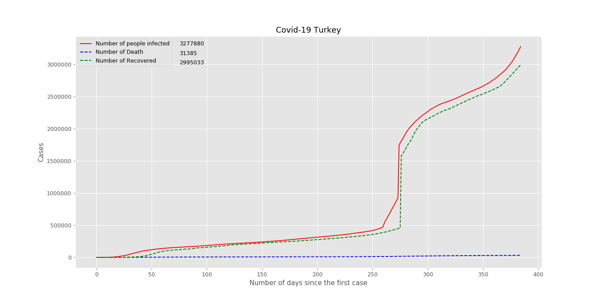

# Visualizing Covid-19 Data with Python Matplotlib

**Global Covid-19 case statistics on one of the public APIs**
**collected and visualized with Python's Matplotlib Library**

It's recommended to create a virtual environment for Python.

```bash
$ python3 -m venv <VENV_NAME>
$ source <VENV_NAME>/bin/activate
```


Some python modules also needed


```bash
$ python3 -m pip install -r requirements.txt
```

**All set up. We just need to run** 

```bash
$ python3 Turkey\ Covid-19.py
```

